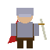

# Crépuscule — mini Vampire Survivors

Un petit jeu d'action « survival roguelite » dans l'esprit de *Vampire Survivors*,
construit en **HTML5 Canvas + JavaScript vanilla** (aucune compilation, aucune dépendance).

Les graphismes et les sons proviennent de **ton dépôt GitHub `Sand`**
(`rpg_game/godot_export/assets/` — pack d'assets Kenney, licence CC0).



## Comment jouer

- **Se déplacer :** `WASD` ou les flèches
- **Attaquer :** automatique — ton arme vise toute seule l'ennemi le plus proche
- **Monter en niveau :** ramasse les gemmes bleues lâchées par les monstres
- **Pause :** `P` ou `Échap` · **Couper le son :** `M`

À chaque niveau, tu choisis une amélioration (plus de projectiles, plus de
dégâts, perforation, vitesse, vie, aimant…). Plus tu survis, plus les vagues
sont denses et coriaces (gobelins → bandits → gardes).

## Lancer le jeu

### Option 1 — double-clic (le plus simple)
Ouvre `index.html` dans ton navigateur.

### Option 2 — petit serveur local (recommandé)
Évite tout souci de chargement des sons selon le navigateur :

```powershell
./play.ps1
```

Le script démarre un serveur local et ouvre la page automatiquement.

## Structure

```text
vampire-survivor/
├─ index.html          Page + HUD + menus
├─ css/style.css       Habillage (HUD, panneaux, cartes)
├─ js/
│  ├─ assets.js        Préchargement images + sons
│  ├─ input.js         Clavier
│  ├─ entities.js      Player / Enemy / Projectile / Gem / FloatText
│  ├─ game.js          Boucle, spawn, collisions, niveaux, rendu
│  └─ main.js          Démarrage
├─ assets/
│  ├─ characters/      hero, gobelin, bandit, garde (64×64, CC0)
│  ├─ ui/              barres de vie Kenney (3 tranches)
│  ├─ map/             world_map, icônes
│  └─ audio/           coups, pas, pièces, clics (.ogg)
├─ CREDITS.md
└─ play.ps1
```

## Idées pour la suite

- Plusieurs armes simultanées (aura, projectiles en orbite, zone)
- Un boss toutes les 2 minutes (sprite `garde`/`marchand` agrandi)
- Coffres et objets passifs ; barre d'XP qui « éclate » à la montée de niveau
- Mini-carte, vagues scriptées, écran de fin avec récap détaillé
